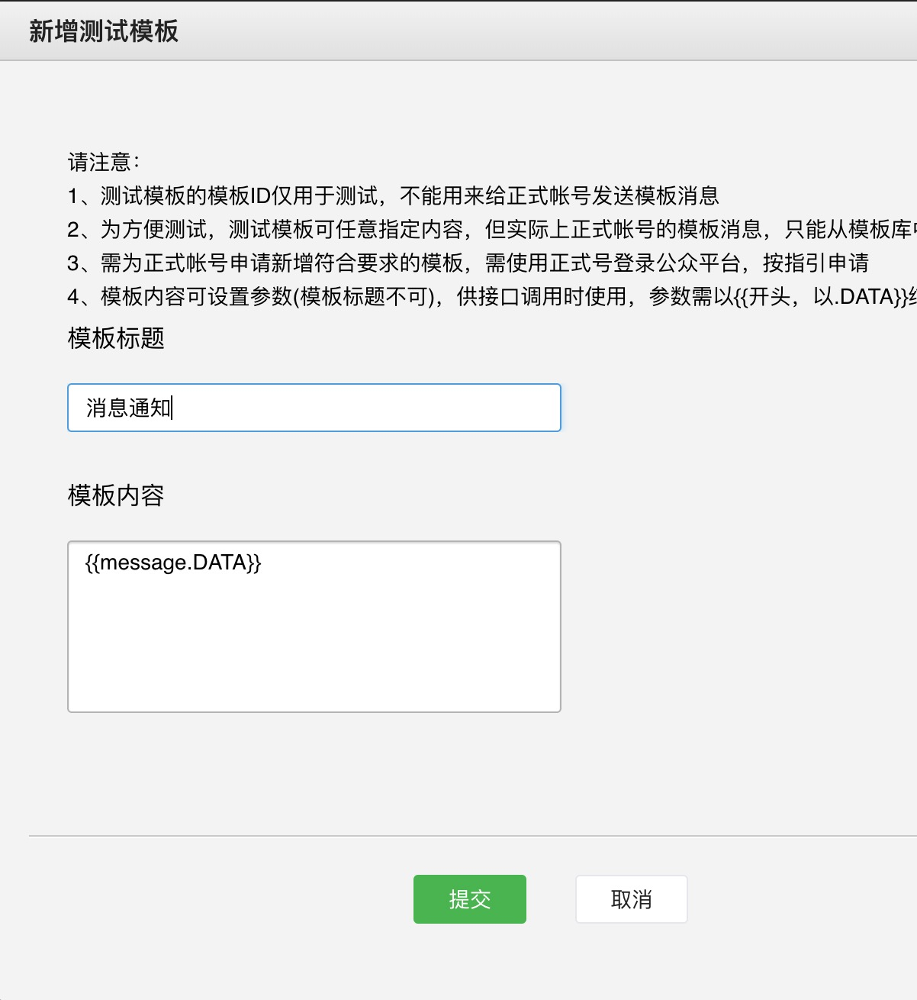
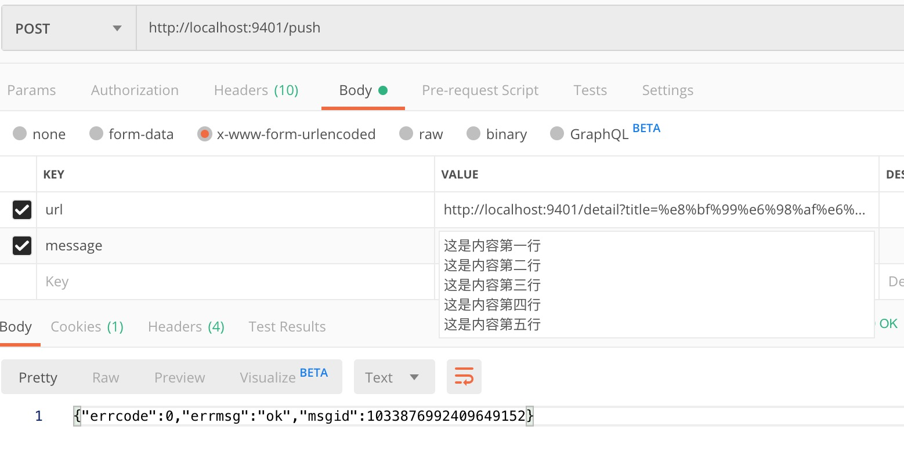
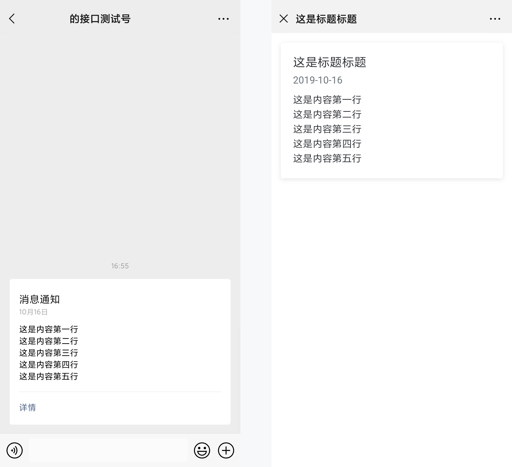

## 配置
[注册测试号](https://mp.weixin.qq.com/debug/cgi-bin/sandboxinfo?action=showinfo&t=sandbox/index)

增加消息模板`{{message.DATA}}`



根目录创建文件`config_custom.js`，也可以直接修改`config.js`

```
module.exports = {
    logger: false,
    app_id: "[AppID]",
    app_secret: "[AppSecret]",
    recipient: "[收件人微信ID]",
    template_id: "[发送模板ID]"
}
```

## 启动
### Node启动

```
node api.js
```

### PM2启动

```
pm2 start api.js --name wx_push
```

## API
POST | GET

```
/push
```
| 参数名 | 是否必选 | 备注 |
|:-:|:-:|:-:|
| url | 否 | 点击消息跳转的链接 |
| message | 是 | 推送的内容 |

### POST示例



`url`可以使用`detail`，`title`和`message`需要`URLEncode`

```
http://localhost:9401/detail?title=%e8%bf%99%e6%98%af%e6%a0%87%e9%a2%98%e6%a0%87%e9%a2%98&time=2019-10-16&message=%e8%bf%99%e6%98%af%e5%86%85%e5%ae%b9%e7%ac%ac%e4%b8%80%e8%a1%8c%0d%0a%e8%bf%99%e6%98%af%e5%86%85%e5%ae%b9%e7%ac%ac%e4%ba%8c%e8%a1%8c%0d%0a%e8%bf%99%e6%98%af%e5%86%85%e5%ae%b9%e7%ac%ac%e4%b8%89%e8%a1%8c%0d%0a%e8%bf%99%e6%98%af%e5%86%85%e5%ae%b9%e7%ac%ac%e5%9b%9b%e8%a1%8c%0d%0a%e8%bf%99%e6%98%af%e5%86%85%e5%ae%b9%e7%ac%ac%e4%ba%94%e8%a1%8c
```

